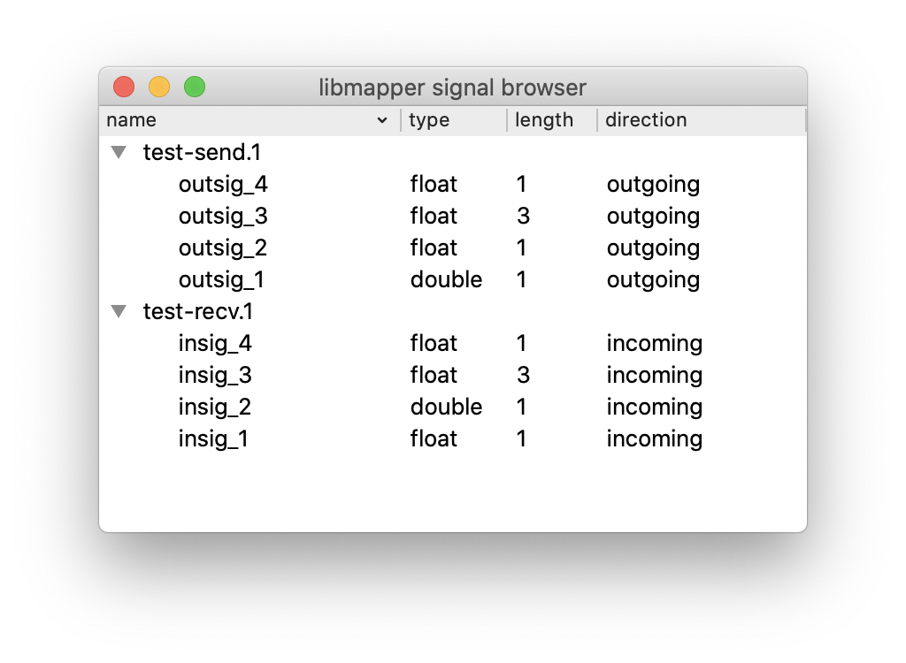

# pySignalBrowser

pySignalBrowser is a utility for viewing the devices and signals currently present in the libmapper distributed graph. To launch the program from the command line, simply type:

~~~
$ python ./pySignalBrowser.py
~~~

## Drag and drop (Experimental)

Signals can be dragged out of the browser and dropped onto compatible UI objects. This can be tested with the program [pySignalPlotter](./../../visualisation/pySignalPlotter) included in this repository.

## Roadmap / Todo list

* enable viewing and setting network interfaces
